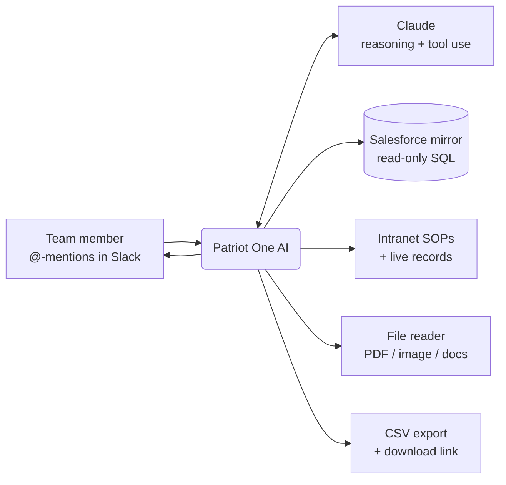

# Patriot One AI

**An internal AI operations agent for a freight brokerage — live in Slack, grounded in real company data.**

Patriot One AI is a production Slack bot that the whole team @-mentions to ask questions about loads, margins, lanes, accounts, and operations. It reads from a live mirror of the company's Salesforce org and its internal knowledge base, runs analysis on demand, reads files people drop in, and returns answers (and downloadable exports) right in the channel.

It runs always-on, learns permanently from being taught, and is read-only by design — it informs and analyzes, it never mutates source systems.

> This repository documents the **architecture and capabilities** of Patriot One AI. It is a living document, updated as the system grows. No secrets, credentials, or infrastructure identifiers live here.

---

## What it does

| Capability | Description |
|---|---|
| 🔎 **Ask the data** | @-mention it with a plain-English question; it writes and runs a read-only query against the Salesforce mirror and answers in-thread. |
| 📊 **Analyze & summarize** | Margin/GP, lane performance, rep trends, billing velocity — computed on demand from curated analytics tables. |
| 📁 **Read files** | Attach a PDF, image, transcript, or doc and it reads/analyzes it natively (rate sheets, screenshots, meeting notes). |
| 📤 **Export to CSV** | Turns query results into a downloadable CSV and returns a working link. |
| 📚 **Knows the playbook** | Searches the company intranet's SOPs/policies and reads live operational records. |
| 🧠 **Learns** | Teach it a rule once (`remember: …`) and it applies it forever. |
| 🔒 **Read-only & safe** | Only `SELECT`/`WITH` queries, with row and time caps. Cannot change source systems. |

---

## How it works

1. **Surface** — a user @-mentions the bot in a Slack channel; it replies in-thread so the whole team sees the answer.
2. **Reasoning** — the message (plus any attached files and recent thread context) goes to Claude with a curated set of tools and baked-in schema knowledge.
3. **Tools** — Claude decides which source to use: read-only SQL against the data mirror, the intranet knowledge base, live operational records, or the file reader. A bounded tool loop runs until it has an answer.
4. **Answer** — a concise reply lands in the thread; when the user wants the underlying rows, the bot exports a CSV and returns a download link.

Everything is **read-only**. The bot's SQL tool accepts a single `SELECT`/`WITH` statement only, enforces row and time limits, and has no write path to any source system.

---

## Design principles

- **Grounded, not hallucinated.** Answers come from a live mirror of the real org and curated analytics tables — with schema knowledge (dedup rules, status lifecycle, money-field types) baked into the prompt so the model uses the right tables and avoids common traps.
- **One front door.** The long-term goal is a single agent the whole team talks to. Data sources are added incrementally behind the same Slack interface.
- **Teachable.** Domain rules and corrections are saved to a durable knowledge file via `remember:` — the bot gets smarter without a redeploy.
- **Safe by construction.** Read-only query guard, row/time caps, and no mutation path. The blast radius of a bad query is a slow read, not corrupted data.
- **Cheap and always-on.** Runs on a small cloud VM as a managed service that auto-restarts on crash or reboot.

---

## Capabilities in detail

See **[docs/CAPABILITIES.md](docs/CAPABILITIES.md)** for the full capability list and example prompts, and **[docs/ARCHITECTURE.md](docs/ARCHITECTURE.md)** for the component-level design.

---

## Roadmap

- [x] Natural-language Q&A over the Salesforce mirror
- [x] Intranet SOPs + live operational records
- [x] File / attachment reading (PDF, image, docx, transcripts)
- [x] CSV export with download links
- [ ] Richer charts/visual exports
- [ ] Authenticated, expiring links for exported artifacts
- [ ] Consolidation toward a single team-wide agent across all data sources
- [ ] Spec-drafting for Salesforce automation, grounded in live org metadata (human-in-the-loop, sandbox-first)

---

## Status

Production. Used daily by the team. This doc tracks the system as it evolves.

*Built with [Claude Code](https://claude.com/claude-code).*
