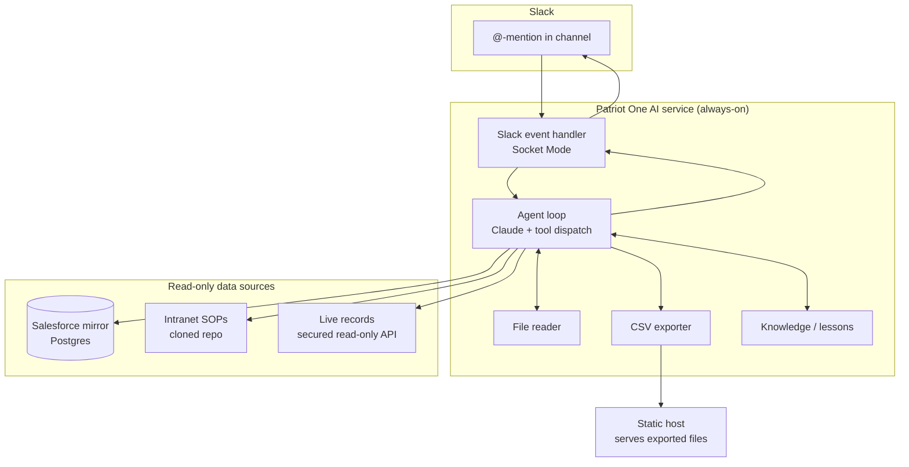
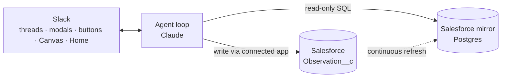

# Architecture

Patriot One AI is a single always-on service that bridges Slack, a large language model, and a set of read-only company data sources.

## Components

## Request lifecycle

1. **Event in** — a Slack mention arrives over Socket Mode. The handler gathers the message text, any attached files, and recent thread history for context.
2. **Compose** — files are converted to model-native content blocks (images and PDFs natively; documents and transcripts as text). The question, attachments, and history become the model input.
3. **Reason + act** — Claude runs a bounded tool loop. On each turn it may call a tool (run a query, search SOPs, read live records, save a lesson, export a CSV) or produce the final answer.
4. **Respond** — the final text is posted back in-thread. If an export was produced, a download link is included.

## The data layer

- **Salesforce mirror** — a replicated, read-only Postgres copy of the live Salesforce org, refreshed continuously. The bot queries this rather than the live org, so analytics load never touches production CRM. Curated analytics tables and schema knowledge (dedup rules, status lifecycle, money-field types) are baked into the system prompt so the model targets the right tables.
- **Intranet knowledge** — the internal SOP/policy app's source is cloned locally and searched for procedures and structure; a separate secured, read-only API exposes a hand-picked allow-list of operational tables (requests, initiatives, training, etc.). Sensitive tables (credentials, roles, profiles) are excluded at the API layer.

## Safety model

- **Read-only query guard** — the SQL tool accepts exactly one `SELECT`/`WITH` statement; anything else is rejected before execution.
- **Resource caps** — row limit and statement timeout on every query.
- **No write path to source systems** — no tool mutates Salesforce, the intranet, or any source system. Generated artifacts (CSV exports) are written only to an isolated host directory. The one exception is the Continual Improvement observation store, which the bot owns (see below) — it is not a source system.
- **Scoped data exposure** — the live-records API is allow-listed; sensitive tables are never reachable.

## Controlled write path — Continual Improvement

> Planned phase. See **[CONTINUAL-IMPROVEMENT.md](CONTINUAL-IMPROVEMENT.md)** for the full design.

The Continual Improvement Project (QP-160-1) introduces the system's first write capability. Observations are stored in Salesforce as a custom object (`Observation__c`), and the entire lifecycle — submission and review — happens in Slack. The write path is deliberately isolated so the read-only guarantee is preserved:

- **Separate write lane.** Observation create/update goes through a dedicated Salesforce **connected app** (JWT auth) via the REST API, limited by permission set to `Observation__c` only. The read-only SQL tool and its guard are unchanged; the two paths share no code.
- **Reads stay read-only.** The bot continues to answer from the read-only mirror. Newly written observations flow into the mirror on its next refresh, so reads never touch a live write path.
- **Scoped by permission.** The connected app can create/edit exactly one object. It cannot mutate loads, accounts, billing, or any other Salesforce data; the intranet and SOPs remain read-only as before.
- **Slack-native interface.** Intake is conversational; field edits use Block Kit modals; actions (advance phase, assign owner, set risk, close) use message buttons; the monthly review and trend report render as a Slack Canvas. No separate portal.
- **Human-controlled lifecycle.** Employees create observations and append detail; risk, phase, ownership, and closure are leadership-assigned. Corrective actions are created and managed in Salesforce by leadership and referenced by native lookup, never written by the bot.
- **Auditable and retained.** Salesforce field history captures phase/status transitions; records are kept a minimum of 3 years per QP-160-1 §9.

The Salesforce CLI (`sf`) is used for **setup and admin** — deploying the object, fields, and permission set, and bulk operations. Live per-observation writes use the REST API directly (same connected-app auth), not a CLI subprocess.

## Reasoning engine

- Claude (Anthropic API) with adaptive thinking and prompt caching.
- A manual tool loop with a hard iteration cap, so a request always terminates.
- Per-tool dispatch with structured results fed back to the model until it answers.

## Operations

- Runs as a managed service on a small cloud VM; auto-restarts on crash or reboot.
- Exported artifacts are served by a lightweight static host.
- Updates are deployed by syncing code and restarting the service. Taught lessons and synced knowledge live on the server and are preserved across deploys.

---

*Infrastructure identifiers, endpoints, and credentials are intentionally omitted from this public document.*
