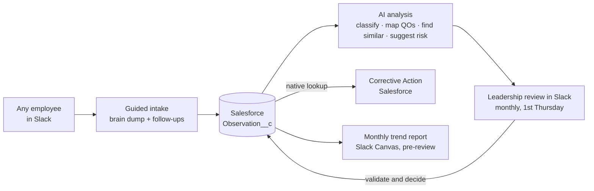

# Continual Improvement (next phase)

> **Status: planned / in design.** This documents the next phase of Patriot One AI, not a shipped capability. It implements the company's **QP-160-1 Continual Improvement Procedure** (ISO 9001:2015, Clause 10.3). Fields and flows below reflect the intended design and may change during build.

Everything Patriot One does today is read-only. This phase adds the system's **first controlled write capability** — a place for the whole company to submit *observations* (recurring patterns, risks, and improvement opportunities) and for leadership to review them on a monthly cadence, **entirely inside Slack.** The bot captures, classifies, and finds trends; **leadership validates and decides.** The AI is decision support, never the decision.

Two design commitments shape this phase:

- **One front door.** Submission and review both happen in Slack — the surface the team already lives in. No separate portal to visit. This holds Patriot One's core "single agent the whole team talks to" principle.
- **Salesforce is the system of record.** Observations are stored as a Salesforce custom object (`Observation__c`), alongside the Corrective Action Program they may feed. Governance, audit history, retention, and reporting come from the platform the company already runs its quality system on.

## What it is

The **Continual Improvement Project** is Patriot Freight Group's organizational observation repository — the funnel where operational, financial, customer, carrier, compliance, and process observations are captured before the knowledge is lost, then converted into validated improvements, SOP revisions, training, or corrective actions when warranted.

It is deliberately *not* a complaint box, disciplinary tracker, or performance record. An observation belongs here when it is recurring, affects a Quality Objective, has measurable business impact, or exposes a process/training/technology/compliance gap.

## Flow

1. **Submit (Slack)** — any employee @-mentions the bot (or uses a `/observe` entry point) and describes what they're seeing in plain language. No forms required. The bot asks the QP-160-1 §6.3 follow-ups as needed: what was observed, why it may matter, whether it's recurring, who/what is affected, supporting evidence, potential business impact.
2. **Capture (Salesforce)** — the bot creates a **draft `Observation__c` record** and assigns an Observation ID (`MONTH-###`, e.g. `JUNE-001`). Employees are never asked to set risk, phase, owner, or review date — those are leadership's to assign.
3. **Analyze** — the bot suggests a classification, maps the observation to affected Quality Objectives, surfaces similar prior observations, flags potential recurring themes, and proposes a risk level and possible next steps (all *suggestions*, written back to the record for review).
4. **Review (Slack)** — on the **first Thursday of the following month**, leadership reviews the month's observations in Slack — a generated Canvas summary plus actionable messages. Adjusting a suggestion, assigning an owner, advancing a phase, or closing with rationale happens through Slack modals and buttons, and writes straight back to Salesforce.
5. **Report (Slack)** — before the review, the bot generates a trend-analysis Canvas (recurring themes, related Quality Objectives, risks, recommended discussion topics, corrective-action candidates) for the review record.

## Slack interface

The whole lifecycle stays in Slack — nothing routes to a separate portal:

| Interaction | Slack surface |
|---|---|
| Submit an observation | Conversational thread (@-mention) or `/observe` |
| Bot follow-up questions | In-thread conversation |
| Edit fields (classification, risk, phase, owner, dates) | **Block Kit modal** — dropdowns, date pickers, text areas |
| Act on an observation | Message **buttons** — advance phase, assign owner, set risk, close with reason |
| Monthly trend report + review board | Generated **Slack Canvas** in the review channel |
| "My open observations" dashboard | Patriot One **App Home** tab |

## AI-assisted analysis (decision support only)

On submission the bot proposes, for leadership to confirm or override:

- **Classification** — one of: Sales/CRM · Operations · Finance/Accounting · Leadership/Structure · Technology/Systems · Legal/Risk/Compliance · Training/Competence · Governance/QMS.
- **Related Quality Objectives** — e.g. GP $, GP %, Billing Velocity, Days to Pay, Operational Productivity, Net Profit %, Customer Service Consistency, Organizational Scalability.
- **Similar observations** — related or recurring submissions, for trend analysis. A configurable threshold (default: three or more similar within a period) flags a potential trend.
- **Risk level** — Low / Moderate / High.
- **Recommended levers** — SOP revision, training, automation, contract review, workflow change, leadership development, Patriot One update, or a corrective-action candidate.

Interpretations are grounded in the controlled documents — QP-160-1, Quality Objective definitions, SOPs — loaded into the bot's knowledge base so classification and mapping stay consistent.

## The observation record (`Observation__c`)

Each observation carries the QP-160-1 §7 data elements as fields on the Salesforce custom object. Employees may start with just a plain-language dump; the bot and leadership complete the rest during capture and review.

| Field | Set by |
|---|---|
| Observation ID (`MONTH-###`) | Bot |
| Submitted By / Reporting Party | Bot (from submitter) |
| Observation Title | Bot (normalized) |
| Raw Observation / Brain Dump | Submitter |
| Date Identified · Area · Description | Submitter / Bot |
| Supporting Indicators / Evidence | Submitter |
| Potential Business Impact | Submitter / Bot |
| Related Quality Objectives | Bot suggests → leadership confirms |
| Measurement Standard Impacted | Leadership |
| AI Suggested Classification | Bot |
| AI Identified Similar Observations | Bot |
| Risk Level (Low/Mod/High) | Leadership |
| Current Phase | Leadership |
| Potential Lever / Improvement Area | Bot suggests → leadership confirms |
| Owner · Target Review Date | Leadership |
| Status (Open/In Progress/Pending Review/Closed/Transferred) | Leadership |
| Corrective Action (native lookup) | Leadership |
| Notes / Updates | Leadership / Bot |

## Phase lifecycle

Observations move through phases so leadership never jumps from observation to action without validation:

`Monitor → Validation → Scenario Modeling → Action Design → Implementation → Effectiveness Review → Closed`

## Relationship to other systems

- **Corrective Action Program (Salesforce)** — the formal action-management process for validated nonconformities and significant issues. The Continual Improvement Project is the *funnel*; not every observation becomes a corrective action. When one does, `Observation__c` links to the corrective-action record through a **native Salesforce lookup** — same platform, no cross-system syncing.
- **SOPs & document control** — observations that reveal a missing, unclear, or unfollowed SOP feed the controlled document-revision and training processes.
- **Management review** — monthly results roll up as inputs to quarterly management review.

## How this preserves the safety model

Patriot One's read path is unchanged and stays **read-only**. The write path is new, separate, and deliberately narrow:

- **Reads never change.** The bot still answers questions from the read-only Salesforce **mirror**. New observations written to live Salesforce simply flow into the mirror on its next refresh, so the read path stays 100% read-only and untouched.
- **Writes are isolated and scoped.** Observation create/update goes through a dedicated Salesforce **connected app** (JWT auth) limited by permission set to create/edit on `Observation__c` only — no access to loads, accounts, billing, or any other object. It is a completely separate lane from the read-only SQL tool.
- **Human-controlled lifecycle.** Employees can create observations and append detail; risk, phase, ownership, and closure are leadership-assigned. Corrective actions are created and managed in Salesforce by leadership — the bot references them, never writes them.
- **Auditable and retained.** Salesforce field history captures phase/status transitions; records are retained a minimum of 3 years per QP-160-1 §9.

See the [Architecture](ARCHITECTURE.md#controlled-write-path--continual-improvement) note on the controlled write path.

---

*Implements QP-160-1 Continual Improvement Procedure (Rev 1). This document tracks the design as it is built.*
