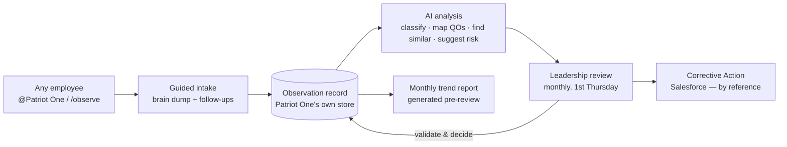

# Continual Improvement (next phase)

> **Status: planned / in design.** This documents the next phase of Patriot One AI, not a shipped capability. It implements the company's **QP-160-1 Continual Improvement Procedure** (ISO 9001:2015, Clause 10.3). Fields and flows below reflect the intended design and may change during build.

Everything Patriot One does today is read-only. This phase adds the system's **first controlled write capability** — a place for the whole company to submit *observations* (recurring patterns, risks, and improvement opportunities) and for leadership to review them on a monthly cadence. The bot captures, classifies, and finds trends; **leadership validates and decides.** The AI is decision support, never the decision.

## What it is

The **Continual Improvement Project** is Patriot One's organizational observation repository — the funnel where operational, financial, customer, carrier, compliance, and process observations are captured before the knowledge is lost, then converted into validated improvements, SOP revisions, training, or corrective actions when warranted.

It is deliberately *not* a complaint box, disciplinary tracker, or performance record. An observation belongs here when it is recurring, affects a Quality Objective, has measurable business impact, or exposes a process/training/technology/compliance gap.

## Flow

1. **Submit** — any employee @-mentions the bot (or uses a `/observe` entry point) and describes what they're seeing in plain language. No forms required. The bot asks the QP-160-1 §6.3 follow-ups as needed: what was observed, why it may matter, whether it's recurring, who/what is affected, supporting evidence, potential business impact.
2. **Capture** — the bot writes a **draft observation record** and assigns an Observation ID (`MONTH-###`, e.g. `JUNE-001`). Employees are never asked to set risk, phase, owner, or review date — those are leadership's to assign.
3. **Analyze** — the bot suggests a classification, maps the observation to affected Quality Objectives, surfaces similar prior observations, flags potential recurring themes, and proposes a risk level and possible next steps (all *suggestions*).
4. **Review** — on the **first Thursday of the following month**, leadership reviews the month's observations, adjusts AI suggestions, assigns ownership and phase, and decides whether to monitor, act, transfer to the Corrective Action Program, or close with documented rationale.
5. **Report** — before the review, the bot generates a trend-analysis summary (recurring themes, related Quality Objectives, risks, recommended discussion topics, corrective-action candidates) and exports it for the review record.

## AI-assisted analysis (decision support only)

On submission the bot proposes, for leadership to confirm or override:

- **Classification** — one of: Sales/CRM · Operations · Finance/Accounting · Leadership/Structure · Technology/Systems · Legal/Risk/Compliance · Training/Competence · Governance/QMS.
- **Related Quality Objectives** — e.g. GP $, GP %, Billing Velocity, Days to Pay, Operational Productivity, Net Profit %, Customer Service Consistency, Organizational Scalability.
- **Similar observations** — related or recurring submissions, for trend analysis. A configurable threshold (default: three or more similar within a period) flags a potential trend.
- **Risk level** — Low / Moderate / High.
- **Recommended levers** — SOP revision, training, automation, contract review, workflow change, leadership development, Patriot One update, or a corrective-action candidate.

Interpretations are grounded in the controlled documents — QP-160-1, Quality Objective definitions, SOPs — loaded into the bot's knowledge base so classification and mapping stay consistent.

## The observation record

Each observation carries the QP-160-1 §7 data elements. Employees may start with just a plain-language dump; the bot and leadership complete the rest during capture and review.

| Field | Set by |
|---|---|
| Observation ID (`MONTH-###`) | Bot |
| Submitted By / Reporting Party | Bot (from submitter) |
| Observation Title | Bot (normalized) |
| Raw Observation / Brain Dump | Submitter |
| Date Identified · Area · Description | Submitter / Bot |
| Supporting Indicators / Evidence | Submitter |
| Potential Business Impact | Submitter / Bot |
| Related Quality Objectives | Bot suggests → leadership confirms |
| Measurement Standard Impacted | Leadership |
| AI Suggested Classification | Bot |
| AI Identified Similar Observations | Bot |
| Risk Level (Low/Mod/High) | Leadership |
| Current Phase | Leadership |
| Potential Lever / Improvement Area | Bot suggests → leadership confirms |
| Owner · Target Review Date | Leadership |
| Status (Open/In Progress/Pending Review/Closed/Transferred) | Leadership |
| Corrective Action Reference | Leadership (links to Salesforce) |
| Notes / Updates | Leadership / Bot |

## Phase lifecycle

Observations move through phases so leadership never jumps from observation to action without validation:

`Monitor → Validation → Scenario Modeling → Action Design → Implementation → Effectiveness Review → Closed`

## Relationship to other systems

- **Corrective Action Program (Salesforce)** — the formal action-management process for validated nonconformities and significant issues. The Continual Improvement Project is the *funnel*; not every observation becomes a corrective action. When one does, the record links to the Salesforce corrective-action reference — Patriot One **reads** its status from the Salesforce mirror and never writes the corrective action itself.
- **SOPs & document control** — observations that reveal a missing, unclear, or unfollowed SOP feed the controlled document-revision and training processes.
- **Management review** — monthly results roll up as inputs to quarterly management review.

## How this preserves the safety model

Patriot One remains **read-only to every source system** — Salesforce, the intranet, SOPs. The only thing it writes is its **own** observation records, in a purpose-built store it owns, through a narrow validated interface:

- Writes are scoped to the single `observations` entity — there is no path to mutate Salesforce, the intranet, or any other source.
- Employees can create and append; risk, phase, ownership, and closure are leadership-controlled.
- Every phase/status change is retained as an audit trail (records kept a minimum of 3 years per QP-160-1 §9).

See the [Architecture](ARCHITECTURE.md#controlled-write-path--continual-improvement) note on the controlled write path.

---

*Implements QP-160-1 Continual Improvement Procedure (Rev 1). This document tracks the design as it is built.*
